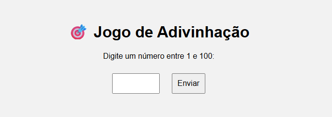

# 🎯 Jogo de Adivinhação - Versão Web


Bem-vindo ao **Jogo de Adivinhação**, um joguinho simples e divertido feito com **HTML, CSS e JavaScript puro**!  
Tente adivinhar o número secreto entre 1 e 100 com o menor número de tentativas possível. 🔢✨

---

## 🖼️ Prévia

> Interface limpa, intuitiva e responsiva!  
> Veja uma prévia abaixo:

 <!-- (Adicione uma imagem chamada preview.png ou remova esta linha) -->

---

## 🚀 Como jogar

1. Clone ou baixe o repositório:
   ```bash
   git clone https://github.com/seu-usuario/jogo-adivinhacao-web.git
